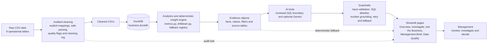
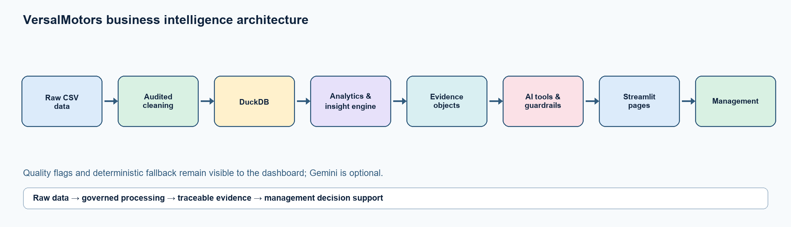
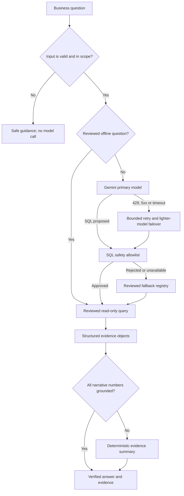

# VersalMotors Architecture

## End-to-end architecture





## Components and responsibilities

| Layer | Implementation | Responsibility |
|---|---|---|
| Raw data | `data/raw/*.csv` | Nine reproducible operational datasets remain unchanged for audit. |
| Cleaning | `src/data/cleaning.py`, `src/data/cleaning_log.py` | Applies reviewed mappings, parses types safely, removes only exact duplicates, preserves raw companions, and flags questionable rows. |
| Build | `scripts/build_database.py` | Recreates `data/cleaned/`, `docs/cleaning_log.csv`, and the local DuckDB database. |
| Database | `data/business.duckdb` | Holds the cleaned analytical tables; it is generated locally and not committed. |
| Analytics and insights | `src/analytics/metrics.py`, `src/analytics/drilldown.py`, `src/ai/fallback.py` | Calculates management metrics, supports claim drill-down, and maps reviewed questions to deterministic evidence. |
| Evidence | Dictionaries and DataFrames returned by analytics/AI tools | Carries the fact, value, filters, and source context used to support an answer. |
| AI tools | `src/ai/gemini_client.py`, `src/database/connection.py` | Optionally interprets questions and executes only approved read-only business queries. |
| Guardrails | `src/ai/guardrails.py`, retry/fallback logic | Rejects unsafe input and SQL, verifies narrative numbers, retries transient failures, and falls back without exposing provider errors. |
| User interface | `app.py`, `pages/`, `src/ui/` | Presents persistent filters, KPIs, charts, drill-downs, evidence, quality results, and PDF downloads. |
| Management | Application users | Use evidence to choose investigations and actions; AI does not make decisions for them. |

## Data and build flow

1. `scripts/generate_dataset.py` can reproduce the synthetic raw source with its fixed seed.
2. `scripts/build_database.py` calls the cleaning pipeline, writes cleaned CSVs, verifies table row counts, and loads DuckDB.
3. Pure pandas functions calculate metrics from cleaned tables. Question and drill-down tools query the same governed data.
4. Evidence objects are passed to optional AI narration and to deterministic fallback summaries.
5. Streamlit renders the result and lets management inspect supporting records.

## Resilient Ask the Business flow



`src/ai/gemini_client.py` owns bounded retry and model failover. `src/database/connection.py` accepts a single `SELECT` or `WITH` statement against allowlisted business tables and blocks mutation, attachment, extensions, and file-reading functions. `src/ai/guardrails.py` checks response numbers against the request evidence. Gemini is therefore an optional interpretation layer, not the source of business facts.

## Failure behavior

| Condition | User-visible result |
|---|---|
| API key absent | Reviewed deterministic query and grounded summary where supported. |
| Gemini returns `429`, `5xx`, or timeout | Bounded retry, lighter-model failover, then deterministic fallback. |
| Generated SQL is unsafe or invalid | SQL is rejected and the reviewed fallback is attempted. |
| AI narrative contains an unsupported number | Narrative is suppressed and evidence is summarized deterministically. |
| Question is unsupported by available data | The limitation is explained without guessing. |
| Filters return no rows | A no-data message is shown without a page crash. |

## Security and configuration

Secrets are loaded from `.env` or Streamlit secrets and are excluded from Git. Model name, fallback models, and retry limits are configurable through `.env.example`. The database and cleaned CSVs are generated artifacts; a fresh clone builds them with:

```powershell
python scripts/build_database.py
python -m streamlit run app.py
```

## Verification boundary

Formula tests use hand-calculated fixtures. Integration tests independently compare revenue, units, and gross margin with direct DuckDB SQL. Streamlit `AppTest` exercises all five pages and AI failure paths. The full stress-test record and limitations are maintained in `docs/test_log.md`.
